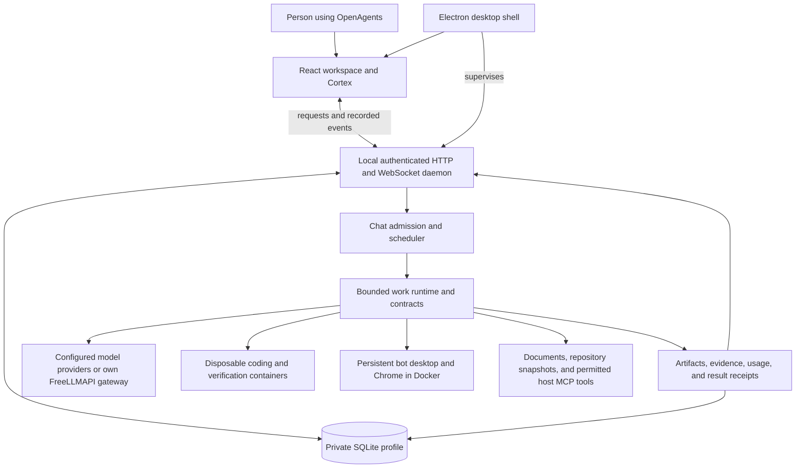

# OpenAgents

**Give your ideas a team. Desktop AI teammates you can inspect, customize, and build on.**

OpenAgents is shared with the community, free of charge. **This project is for you:** explore the code, give your bots a personality, improve the interface, add integrations, fix problems, and help make it better for everyone. Contributions from first-time contributors and experienced developers are welcome.

Special thanks to **[FreeLLMAPI](https://github.com/tashfeenahmed/freellmapi)** and its contributors for making free-tier model access easier to bring into one OpenAI-compatible gateway. OpenAgents can connect to a gateway you run and configure yourself. Thank you, too, to every developer whose libraries, tools, bug reports, and ideas make this project possible.

**Free software does not mean unlimited free inference.** OpenAgents does not charge an app subscription. Model providers, gateway services, Docker products, and hosting have their own terms, quotas, and possible costs. No API keys or funded accounts are included. The example configuration names a model that may be paid; select an eligible free model yourself if you want a free-provider setup.

> **License note:** OpenAgents-authored code is MIT licensed. The currently bundled Aora expression engine and emotion data have separate non-commercial community terms. The complete bundled application is therefore not an unrestricted MIT-only distribution. Read [licensing and credits](docs/licensing-and-credits.md) before commercial use or redistribution.


[App introduction](docs/media/OpenAgents-45s-No-Music.mp4) · [Get started](docs/getting-started.md) · [Contribute](CONTRIBUTING.md) · [Report a bug](https://github.com/Akak0o0y/OpenAgents/issues)

This README is the developer entry point. It explains the current implementation, its execution boundaries, and where to change it. The linked guides contain the detailed setup and configuration reference.

## Contents

- [What you can do](#what-you-can-do)
- [Try the Windows app](#try-the-windows-app--no-build-required)
- [How the system fits together](#how-the-system-fits-together)
- [How work moves through the runtime](#how-work-moves-through-the-runtime)
- [Tools, verification, and external results](#tools-verification-and-external-results)
- [Providers and FreeLLMAPI](#providers-and-freellmapi)
- [Browser, coding, documents, and MCP](#browser-coding-documents-and-mcp)
- [Memory, character, and appearance](#memory-character-and-appearance)
- [Requirements and source setup](#requirements-at-a-glance)
- [Configure a development profile](#configure-a-development-profile)
- [Local API, storage, and privacy](#local-api-storage-and-privacy)
- [Where contributors should change code](#where-contributors-should-change-code)
- [Testing, debugging, and packaging](#testing-debugging-and-packaging)
- [Detailed guides and contributing](#documentation)

## What you can do

| Area | What is in the source |
| --- | --- |
| AI teammates | Named bots with roles, model selection, appearance controls, character settings, and chat history with rolling 24-hour expiry and active-thread protection. |
| Direct work | Chat and bounded tasks, with activity, questions, approvals, results, and downloadable artifacts. |
| Repeat work | Scheduled routines, run history, attention states, and goal/result tracking. Routines need the runtime running. |
| Browser and computer work | Managed browser sessions and a Docker-backed bot desktop. External actions have additional scope and approval checks. |
| Coding | Repository snapshots, scoped guidance, controlled tool access, checked patches, and reviewable results. |
| Documents | Text and rich attachments, supported Office/PDF workflows, and English/Arabic OCR. |
| Model choice | Direct provider paths and configurable OpenAI-compatible connections, including FreeLLMAPI. Model capabilities and availability vary. |
| Visibility | Activity history, budget accounting, and Cortex views of runtime events. A successful tool response is not automatically proof of an external action. |

Chat messages and cached chat requests expire after 24 hours while the runtime is open, and overdue content is cleared when it starts. An in-progress chat finishes before its history is cleared. Task runs, routine results, artifacts, activity evidence, and budget records have separate retention; clearing chat does not erase them. Existing profile backups are separate recovery copies and are not rewritten.

This is an **early community source release, version 0.6.3**. Expect bugs and unfinished areas. Windows desktop has received the most development attention. Linux/macOS runtime work is supported in the code, but their packaged apps and protected credential storage are not at Windows parity. See [known limitations](docs/known-limitations.md) and [validation](docs/validation.md).

## Try the Windows app — no build required

**[Download the portable app](https://github.com/Akak0o0y/OpenAgents/releases/download/v0.6.3-preview.1/OpenAgents-0.6.3-portable.exe)** for a quick trial, or use the **[Windows installer](https://github.com/Akak0o0y/OpenAgents/releases/download/v0.6.3-preview.1/OpenAgents-0.6.3-setup.exe)**. Both are unsigned **Windows x64 preview builds** of 0.6.3 with known bugs; [release notes and checksums](https://github.com/Akak0o0y/OpenAgents/releases/tag/v0.6.3-preview.1) describe validation and limits.

The packaged app includes its runtime. Real AI work still needs your own model connection, and isolated desktop/coding work needs Docker Linux containers. Follow the **[Windows trial guide](docs/try-windows.md)** for first run, WSL, providers, and profile storage. Developers can also build from source below.

## How the system fits together

OpenAgents is a **desktop application with a local, single-profile runtime**. The React interface talks to a Node.js daemon over authenticated loopback HTTP and WebSocket connections. Electron wraps that interface, supervises the daemon, and supplies desktop integration. A standalone browser can use the same daemon without Electron.

Each installation owns its database, bots, credentials, work history, and execution resources. The repository does not include a hosted backend or a shared multi-user account system. Do not expose the daemon to the public internet.



| Layer | Responsibility | Starting point |
| --- | --- | --- |
| React client | Bot settings, conversations, routines, questions, approvals, files, computer view, and live activity. | [`web/src/App.tsx`](web/src/App.tsx), [`transport.ts`](web/src/lib/transport.ts), [`store.ts`](web/src/store.ts) |
| Electron shell | Windows, tray, profile selection, startup/setup, downloads, diagnostics, updates, and daemon ownership. | [`desktop/src/main.mjs`](desktop/src/main.mjs), [`daemon.mjs`](desktop/src/daemon.mjs) |
| Local daemon | Configuration, API authentication, persistent state, scheduling, execution services, and event delivery. | [`src/daemon/index.ts`](src/daemon/index.ts), [`ws-server.ts`](src/daemon/ws-server.ts) |
| Work engine | Capability checks, bounded model/tool loops, cancellation, questions, contracts, checkpoints, and finalization. | [`work-runtime.ts`](src/daemon/work-runtime.ts), [`scheduler.ts`](src/daemon/scheduler.ts) |
| Kernel | Container execution, provider-cost reservations, MCP transport, and runtime layer taxonomy. | [`src/kernel/`](src/kernel/) |
| Cortex | Reduces recorded events into run steps, layers, and the galaxy view. | [`src/cortex/`](src/cortex/), [`CortexRunPanel.tsx`](web/src/components/CortexRunPanel.tsx) |

Cortex is an inspection view of recorded activity. It does not reveal private model reasoning, independently validate conclusions, or prove that a public post exists. The interface should always display real state, including empty, waiting, failed, and uncertain states.

The code retains identifiers such as `OpenHours`, `GrokWorkspace`, and `omni-agent-kernel` for compatibility and implementation history. They do not imply affiliation with another product. Renaming a display label is different from migrating database filenames, profile paths, cookies, encryption metadata, or stored bot IDs.

## How work moves through the runtime

### The core objects

| Object | Meaning |
| --- | --- |
| Bot / agent | A saved teammate with an ID, role/system prompt, model connection, budget, permissions, memory, and related conversations. |
| Conversation | An ordered thread of user and assistant messages. A send can answer directly or use the shared work engine. |
| Task run | One audited execution attempt, with status, model, turns, costs, events, and outputs. A chat turn also has a run record. |
| Work contract | The task's permitted inputs, requirements, writable files, execution limits, and acceptance checks. |
| Routine | A saved instruction triggered by a timetable, manual run, or configured webhook. Each occurrence creates a separate run. |
| Mission | A finite sequence of checked task attempts with an objective, attempt limit, interval, and explicit continuation decisions. |
| Background task | Durable queued work that can be resumed through a checkpoint after an attempt ends. |
| Result requirement / receipt | An expected outcome and the retained evidence used to check whether it exists. This is separate from run status. |

### A request from start to finish

1. The client submits a request to the authenticated daemon. The daemon saves the input and resolves the selected bot, contract, capabilities, and provider route.
2. Admission checks bot availability, shared concurrency, provider cooldowns, usage limits, and applicable approvals. Chat and scheduled work share installation capacity; waiting work does not occupy an execution slot.
3. The runtime prepares a bounded context and workspace. Repository inputs are snapshots; attachments and recalled notes remain untrusted input.
4. The model proposes an answer or tool action. The runtime validates arguments and permissions before the tool runs, then records the observation and streams committed activity to the client.
5. Questions, approvals, unavailable resources, cancellation, or uncertainty can interrupt work. The runtime must preserve those states instead of inventing success.
6. Applicable contract checks run. Outputs, final status, and caller reply are committed together. External result receipts are checked separately.

Run states are `QUEUED`, `RUNNING`, `COMPLETED`, `FAILED`, `ABORTED`, and `CRASHED`; bot states are `IDLE`, `BUSY`, `PAUSED`, and `DISABLED`. A crash recovered at startup is not a successfully completed task. See [`db/schema.ts`](src/daemon/db/schema.ts) and [`agent-store.ts`](src/daemon/agent-store.ts).

Chat sends serialize within a conversation. Request IDs make identical transport retries replayable instead of producing another reply; reusing an ID for different input is refused. An interrupted request that may already have acted requires review rather than silent resubmission. [`chat.ts`](src/daemon/chat.ts) owns these rules.

### Routines and missions

Routines use an explicit IANA timezone and a parsed cron schedule. `catchUpPolicy: "skip"` advances past missed times; `"run_once"` admits one catch-up occurrence. A routine cannot overlap its own queued/running occurrence, and scheduled work serializes per bot. Timetable, manual, and webhook triggers use the same admission path. A stopped daemon or sleeping machine cannot execute work normally.

The default routine task, `routine:ask`, follows the saved instruction with tools. A chat-created routine proposal becomes a routine only after the owner approves its concrete card. Broken schedules and repeated recognized prerequisite failures can put routines into visible attention states. Uncertain external effects can hold subsequent occurrences until reconciled. See [`routine-producer.ts`](src/daemon/routine-producer.ts), [`routine-dispatch.ts`](src/daemon/routine-dispatch.ts), and [`routine-attention.ts`](src/daemon/routine-attention.ts).

A draft-only routine must produce unsent drafts or an honest explanation that no candidate could be verified. A routine configured to require publication has a separate completion gate: it needs a confirmed publication in that run, or must block with a reason. Changing the wording of a final answer cannot satisfy a publication requirement or expand the saved routine's permissions.

Missions retain `ACTIVE`, `PAUSED`, `WAITING`, `COMPLETED`, or `STOPPED` state. Checked attempts decide `continue`, `wait`, or `complete`; continuing requires a concrete next request, and waiting requires a blocker and resume condition. Attempt limits and intervals keep missions finite. This differs from the optional fleet-level standing-goal producer, which can keep introducing work while enabled. Both can consume provider quota. See [`missions.ts`](src/daemon/missions.ts), [`goal-producer.ts`](src/daemon/goal-producer.ts), and [configuration](docs/configuration.md).

### Delegation, background work, and human input

`delegate` runs a synchronous child task: the parent waits, cancellation propagates, and child usage is accounted to the sponsoring work. Cross-bot delegation needs an explicit allowlist; depth is bounded. A suspended parent can lend its capacity slot to its child. Routine runs cannot use delegation to evade their publication limits.

`background_start` creates durable independent work through the scheduler. Checkpoints retain bounded text files/context, and continuation is explicit after the previous attempt ends. An uncertain external action requires owner acknowledgment before continuation. [`background-tasks.ts`](src/daemon/background-tasks.ts) owns persistence and bounds.

Human controls have different purposes:

- **Approval** authorizes a concrete dispatch or external capability; pending live approvals expire and cancel safely.
- **Proposal card** records a durable owner decision, such as creating a routine or adopting a character change.
- **Human assistance** lets the operator clear a sign-in or other real-world blocker.
- **Resumable question** ends an eligible direct-task attempt; answering queues a fresh run with the original request, chronological owner answers, and a bounded checkpoint. It does not replay previous tools.
- **Steering / Stop** changes instructions at a safe turn boundary or aborts queued/active work.

Resumable questions preserve up to 8,000 characters of recent observations and bound the combined resumed request/answers to 32,000 characters. A request that cannot fit must be split; owner instructions are not silently discarded. See [`work-questions.ts`](src/daemon/work-questions.ts), [`control-plane.ts`](src/daemon/control-plane.ts), and the question/assistance components in `web/src/components/`.

## Tools, verification, and external results

[`work-contract.ts`](src/daemon/work-contract.ts) defines conversation, routine, source-report, plan, activity-digest, fixture-code, custom-code, and repository-work contracts. Ordinary conversation/routine work is bounded to at most 60 steps and 15 minutes; repository work permits up to 80 steps and 30 minutes. These are ceilings, not guarantees that every task will finish.

Supported product work uses `WorkRuntime`. Legacy fixed-task paths can use the builtin `AgentLoop` or optional OpenCode executor. OpenCode controls its own loop, so unsupported steering or task approval behavior is refused rather than represented as supported. See [`agent-loop.ts`](src/daemon/agent-loop.ts) and [`opencode-executor.ts`](src/daemon/opencode-executor.ts).

Tools are defined through validated schemas and exposed only when enabled for the task. The runtime supports native provider tool calls and a JSON-action fallback for providers that reject native tools. Tools cover workspace files, isolated execution, plans, memory, research, browser/computer actions, allowed MCP calls, documents, questions, results, delegation, and finish/block decisions. Start at [`tool-schemas.ts`](src/daemon/tool-schemas.ts), [`work-actions.ts`](src/daemon/work-actions.ts), and [`work-runtime.ts`](src/daemon/work-runtime.ts).

### What each check actually establishes

| Work / check | What is checked | What still needs review |
| --- | --- | --- |
| Coding contract | A fixed test command in a fresh verification workspace; fixture acceptance files remain protected. Mutations invalidate earlier verification. | Test coverage, security, suitability, and effects outside the sandbox. |
| Strict source report | Quotes and references match retained captured text. | Whether a source is reliable and whether the interpretation follows from it. |
| Action plan | Required structure, observable conditions, date format, and dependency consistency. | Feasibility; plan steps have not thereby been executed. |
| Flexible conversation/routine | Permissive deliverable checks, including file/package checks where applicable. | Factual accuracy and content quality; this is not independent fact-checking. |
| Office document | Supported package and content structure. | Visual layout, calculations, and editorial quality in the target application. |
| External result | A compatible evidence adapter and retained receipt where implemented. | Anything the adapter cannot independently observe. |

The result manifest supports explicit `artifact`, `message`, `publication`, and `custom` kinds, compatible receipts, dependencies, and revisions. Artifact receipts refer to retained bytes/digests. External attempts distinguish pending, dispatched, uncertain, failed, and verified outcomes. Uncertain submissions must be reconciled before another send. Unsupported custom requirements cannot become verified just because the model says they succeeded. See [`goal-results.ts`](src/daemon/goal-results.ts), [`work-results.ts`](src/daemon/work-results.ts), and [`external-effects.ts`](src/daemon/external-effects.ts).

**A `COMPLETED` run and a satisfied result checklist are separate dimensions.** The work engine enforces its contract verifier and the routine publication completion policy. It does not universally enforce every generic result requirement at finalization; unresolved results remain visible. Contributors should preserve this distinction and improve enforcement with explicit tests rather than assuming a green run means every outcome exists.

Research evidence is bounded to 12 source slots per run, including captured input/context sources. Identical snapshots reuse evidence. Reaching that bound should lead to using retained sources, not repeated capture attempts. Necessary browser interaction remains possible. An X search page containing only loading/navigation text and no verifiable post links is unavailable evidence; the app does not guarantee access to X post content or engagement metrics.

## Providers and FreeLLMAPI

There are two main configuration routes: supported direct-provider environment paths, and saved OpenAI-compatible connections managed in Settings. A connection contains its base URL, protected key reference, model catalog, and request/token limits. Bots select a connection and model; saving a connection does not automatically switch existing bots.

For FreeLLMAPI:

1. Install and configure **your own** compatible [FreeLLMAPI gateway](https://github.com/tashfeenahmed/freellmapi), including permitted upstream providers.
2. Use the FreeLLMAPI preset in OpenAgents Settings, enter your gateway's base URL/client key, and set admission limits.
3. Test the connection and refresh its model catalog, then select that connection/model for a bot.
4. Run a small real request and inspect the served model and usage. A successful catalog request does not prove generation works.

The optional gateway supervisor can locate/start an already installed compatible checkout. It does not clone the gateway, install its dependencies, or supply accounts/keys. The gateway needs a compatible standalone Node installation even when OpenAgents itself is packaged. See [`local-gateway.ts`](src/daemon/local-gateway.ts) and [providers](docs/providers.md).

Routing records the requested and served model where available. A gateway may substitute according to its own routing rules; concrete FreeLLMAPI model preferences are not exact-model guarantees. Per-bot USD budgets and request/token limits are local admission controls, not an invoice or a promise of free inference. Unknown cost is not zero. Use the provider's own billing/quota page for authoritative account usage.

Saved provider secrets currently use **Windows-user DPAPI**. Linux/macOS production protected storage reports unavailable; the in-memory secret store is a test fixture. Key values are resolved for execution and are not returned as plaintext in UI responses. Provider URL/redirect handling must preserve credential boundaries. Extension points are [`provider-connections.ts`](src/daemon/provider-connections.ts), [`provider-router.ts`](src/daemon/provider-router.ts), [`secret-store.ts`](src/daemon/secret-store.ts), and [`src/evals/llm/`](src/evals/llm/).

## Browser, coding, documents, and MCP

These execution paths have different privileges. Treating all of them as the same sandbox would hide an important boundary.

| Path | Environment and persistence | Developer responsibility |
| --- | --- | --- |
| Coding / verifier | Disposable task and verification containers; contract checks run offline after dependency preparation. | Preserve filesystem scopes, protected fixtures, resource limits, cancellation, and current verification. |
| Bot browser / computer | Internet-enabled Docker Linux x64 desktop, regular Chrome, persistent home/profile per installation and bot. | Protect account/origin scope, egress, fresh targeting, publication receipts, and operator handoff. |
| MCP server | Configured host subprocess communicating over stdio, outside the coding container. | Trust the installed server and explicitly restrict each bot's servers/tools/quota/environment. |
| Model / gateway | Your configured local or remote service receives prompts/context. | Handle credentials, quotas, outages, capabilities, and served-model truthfully. |

### Bot computer and browser

The current daemon always supplies a bot-owned Docker desktop to its browser tools. **There is no default host-browser fallback.** Preparing the desktop requires an x64 Linux Docker engine; lack of Docker is a visible setup failure. Shutdown stops containers while retaining bot home volumes and Chrome profiles. Installing Playwright Chromium is still needed by standalone browser adapters and browser tests; it does not replace the app's Docker Chrome setup.

[`bot-desktop.ts`](src/daemon/bot-desktop.ts) owns container identities/resources; [`docker/bot-desktop/`](docker/bot-desktop/) supplies the desktop recipe and gateway. [`browser-tools.ts`](src/daemon/browser-tools.ts) adapts Playwright snapshots/actions, downloads/uploads, run leases, and cancellation. [`desktop-viewer.ts`](src/daemon/desktop-viewer.ts) exposes authenticated viewing/control.

Browser actions select a target ref or role plus accessible name from a **fresh snapshot**. A page change can invalidate an older target. Saved account credentials are protected and typed only on matching sites. Account grants, browser autonomy, and publication policy are separate checks; a model's click or final text is not a publication receipt. See [`browser-accounts.ts`](src/daemon/browser-accounts.ts), [`browser-egress.ts`](src/daemon/browser-egress.ts), [`browser-publish.ts`](src/daemon/browser-publish.ts), and [`publish-policy.ts`](src/daemon/publish-policy.ts).

### Repository work and publication

Repository work imports an approved local alias or GitHub snapshot, pins its base commit/content, and creates a bounded task. Archive extraction and selected paths are checked. Workspace guidance reads applicable `AGENTS.md` / `CLAUDE.md` chains and supported skill files from the snapshot; discovery does not run skill scripts or scan the daemon's home.

The coding result is a reviewable changed-file set, unified patch, and verification report. It does not automatically commit, push, or open a PR. Publication is a separate permitted GitHub path with an owner-approved preview/digest and unchanged base commit; a moved branch invalidates the previous preview. Reading a repository does not grant publication rights. Local snapshots cannot publish through that GitHub path.

Start with [`repository-snapshot.ts`](src/daemon/repository-snapshot.ts), [`repository-work.ts`](src/daemon/repository-work.ts), [`workspace-guidance.ts`](src/daemon/workspace-guidance.ts), and [`repository-publication.ts`](src/daemon/repository-publication.ts).

### Attachments and generated documents

Attachments retain original bytes and extracted text in bot/thread-scoped storage. Supported extraction includes images, PDF, DOCX, XLSX, PPTX, and English/Arabic OCR. Resource-limited workers bound parsing time and memory. Current binary limits are 2 MiB per attachment, four per task, and 64 MiB installation storage. Extracted text is untrusted; spreadsheet attachment formulas are not evaluated.

Document tools generate supported DOCX/XLSX/PPTX outputs with structural checks, templates, and bounded table/chart/formula support. They are not full Microsoft Office editors. Unsafe archives/macros/external relationships are refused. Downloadable artifacts retain content and provenance independently of chat retention. See [`attachments.ts`](src/daemon/attachments.ts), [`attachment-worker.ts`](src/daemon/attachment-worker.ts), [`document-tools.ts`](src/daemon/document-tools.ts), and [`artifacts.ts`](src/daemon/artifacts.ts).

### MCP integrations

Top-level configuration declares trusted server commands, arguments, explicit environment, connection timeouts, call quotas, and optional tool allowlists. A bot's `mcpServers` list grants access; an empty list denies it. The registry checks those grants before every call and records refusals/failures as well as successes. Host MCP processes can cause real external effects; their access is not constrained by the task container.

Use [`mcp-registry.ts`](src/daemon/mcp-registry.ts) for permissions and lifecycle, and [`src/kernel/mcp-client.ts`](src/kernel/mcp-client.ts) for protocol transport. See [configuration](docs/configuration.md) before adding a server.

## Memory, character, and appearance

Context, durable memory, behavioral character, and avatar appearance solve different problems:

| System | Purpose | Source |
| --- | --- | --- |
| Working context | Keeps original owner/steering instructions and recent complete tool observations within model limits; compacts older observations. Full audit events remain stored. | [`context-budget.ts`](src/daemon/context-budget.ts) |
| Bot memory | Scoped notes and bounded recall; imported/model notes remain untrusted, and model notes cannot overwrite owner/imported notes. Optional Obsidian access requires an explicit vault. | [`memory.ts`](src/daemon/memory.ts) |
| Character | Versioned `off`, `voice`, and `character` behavior; identity, style, evidence, claims, proposals, review, and growth. | [`character-schema.ts`](src/daemon/character-schema.ts), [`character-compiler.ts`](src/daemon/character-compiler.ts), [`character-store.ts`](src/daemon/character-store.ts) |
| Avatar / profile | Shape, colors, expression, uploaded image, and UI preferences. | [`botProfile.ts`](web/src/lib/botProfile.ts), [`web/src/lib/aora-bot/`](web/src/lib/aora-bot/), [`AvatarStudio.tsx`](web/src/components/AvatarStudio.tsx) |

Voice examples teach style; they are not biography or evidence of real activity. Character claims can be provisional, disputed, or adopted through evidence/review. Code surfaces and Off mode preserve the parity path. Changing a personality or appearance never silently grants tools, accounts, or publication rights. Character retention is separate from the 24-hour chat policy. Read [customization](docs/customization.md) and the bundled expression-engine [license exception](docs/licensing-and-credits.md).

## Requirements at a glance

| Requirement | When you need it |
| --- | --- |
| Git and Node.js **22.13 or newer** | Building/running from source. Node 24 is the recommended development baseline. |
| npm | Install the root, web, and optional desktop dependency sets from the committed lockfiles. |
| Docker with **Linux containers** | Isolated coding checks and the bot desktop. Basic UI development does not require a running Docker engine. |
| Windows virtualization and WSL 2 | For the Docker Desktop WSL backend. A separate Linux computer is **not** required. A user-managed Ubuntu distro is optional. |
| Playwright Chromium | Standalone browser adapters and browser integration tests; install with `npm run browser:install`. The app's bot browser uses Docker Chrome. |
| A configured model provider | Real AI responses. A provider's free tier is subject to that provider's limits. |
| Internet access | Dependency/browser/image downloads and remote models or web tasks. |

Plan for several GB of free disk space for dependencies, browsers, and Docker images. More RAM helps when running multiple bots; start with one concurrent task. These are practical planning notes, not measured hardware minimums. Follow the linked vendor requirements in the setup guide.

## Start from source

```bash
git clone https://github.com/Akak0o0y/OpenAgents.git
cd OpenAgents
npm ci
npm --prefix web ci
npm run build
npm run web:build
```

Create your local files (they are ignored by Git):

```powershell
# Windows PowerShell
Copy-Item .env.example .env
Copy-Item openhours.config.example.json openhours.config.json
```

```bash
# Linux / macOS
cp .env.example .env
cp openhours.config.example.json openhours.config.json
```

Read `.env.example` and configure your provider, or start the interface first and configure a supported provider connection in Settings. Then:

```bash
npm run daemon
```

Open **http://127.0.0.1:4001**. Browser access uses the local token generated beside the database in `data/openhours.db.auth.json`; enter it only into your local OpenAgents connection screen. Do not share or commit it. The desktop shell handles its own local connection.

For the Electron shell, install its separate dependencies and generate icons:

```bash
npm --prefix desktop ci
npm --prefix desktop run icon
npm run desktop
```

The shell manages a daemon/profile of its own. Stop the standalone daemon first if you want one runtime, and follow [development](docs/development.md) for hot reload and explicit profiles. No preconfigured personal profile, provider key, signed installer, or hosted service is shipped in this source repository.

### Hot reload

For browser development, keep `npm run daemon` running in one terminal and run `npm run web:dev` in another. Open `http://127.0.0.1:5173`. Vite proxies the local daemon; its server-side auth handling keeps the token out of the browser bundle.

For Electron development, run `npm run web:dev` and `npm run desktop:dev` in separate terminals after building the backend and installing desktop dependencies. Choose one runtime/profile arrangement; do not start two writers against the same SQLite database. Backend source changes require a rebuild and appropriate daemon restart. See [development](docs/development.md) for proxy overrides and isolated profiles.

## Configure a development profile

Start from [`openhours.config.example.json`](openhours.config.example.json) and [`.env.example`](.env.example). The configuration is JSON, so comments are not allowed. The schema in [`config-file.ts`](src/daemon/config-file.ts) is authoritative. Keep real configuration, provider keys, and repository grants private.

| Setting | What it controls |
| --- | --- |
| `agents` | Stable IDs, names/roles, optional system prompt override, model/connection/routing, budget, approval requirement, MCP grants, delegation allowlist, and optional vault. |
| `routines` | Bot, instruction, task type, schedule/timezone, enabled state, and catch-up policy. The committed example routine starts disabled. |
| `scheduler` | Scheduling cadence and installation concurrency. Begin with one concurrent task. |
| `contracts` | Owner-defined checked coding tasks; start with the [contract example](docs/examples/custom-task-contract.json). |
| `repositories` | Allowed local aliases and GitHub repos/token-variable references; publication is an explicit separate flag. |
| `mcpServers` | Trusted host processes plus tool/environment/quota restrictions. |
| `browser`, `research`, `visionModels` | Availability/capacity and explicitly verified model image-input capability. Browser adapter isolation names do not enable a host fallback in the daemon. |
| Optional `mission` | Fleet-level standing work; leave absent while validating a basic setup. |

Use the `OPENAGENTS_*` prefix for daemon/desktop settings. [`env-alias.ts`](src/kernel/env-alias.ts) preserves compatible internal `OPENHOURS_*` names. Some development tooling still documents legacy variables explicitly.

| Environment variable | Use |
| --- | --- |
| `OPENAGENTS_DB_PATH` | Standalone daemon database path; default `data/openhours.db`. |
| `OPENAGENTS_CONFIG` | Explicit fleet file; `none` ignores local fleet files. |
| `OPENAGENTS_ENV_FILE` | Explicit existing credential env file; additional default env sources are still checked. |
| `OPENAGENTS_PORT` | Standalone daemon port, normally 4001. |
| `OPENAGENTS_DATA_DIR` | Absolute Electron profile override for a separate development/test installation. |
| `OPENAGENTS_DOCKER_CMD` / `OPENAGENTS_WSL_DISTRO` | Explicit Docker executable or opt-in named WSL transport. Normal Docker Desktop uses its native CLI. |
| `OPENAGENTS_EXECUTOR` | `builtin` or optional `opencode` for applicable task paths. |
| `OPENAGENTS_LLM_MODE=mock` | Explicit synthetic test mode; no real inference or external-effect qualification. |
| `OPENAGENTS_MISSION` | Standing-goal override; enabling it can cause recurring work/provider use. |

Provider variables such as `OPENROUTER_API_KEY`, `OPENCODE_API_KEY`, and direct evaluation-provider keys serve different execution paths; they are not interchangeable. Follow [providers](docs/providers.md) rather than assuming every key works in every mode. Advanced limits marked `PROVISIONAL_*` in [`config.ts`](src/daemon/config.ts) are estimates, not calibrated guarantees.

## Local API, storage, and privacy

The daemon uses authenticated loopback HTTP/WebSocket connections, with a bearer token or local session cookie. A sibling `<database>.auth.json` contains the private token and profile identity. A profile lock permits one daemon owner/writer. Electron checks daemon profile/API/build identity before attaching and supervises only the runtime it owns.

The main window uses context isolation, renderer sandboxing, and disabled Node integration. [`preload.cjs`](desktop/src/preload.cjs) exposes a narrow named bridge. New UI features should not expose arbitrary IPC channels, shell execution, or unrestricted filesystem access.

Useful API entry points are defined in [`ws-server.ts`](src/daemon/ws-server.ts) and [`system-api.ts`](src/daemon/system-api.ts):

| Route / channel | Purpose |
| --- | --- |
| `GET /health`, `GET /api/state` | Authenticated health/identity and fleet/run snapshot. |
| `/api/chat/threads` and thread messages | Create/read conversations and submit messages using the supported method. |
| `GET /api/routines` | Routine definitions/state; mutation routes use explicit methods. |
| `GET /api/runs/:id/events` | Run evidence/activity, optionally from a prior event ID. |
| `GET /api/runs/:id/workspace` | Scoped live workspace listing or supported file read. |
| `/api/providers`, `/api/plugins`, `/api/system` | Provider, MCP/plugin, and capability-specific operations. |
| WebSocket | State/events and supported operator commands/subscriptions. |

Use the client transport as the integration example and inspect route method/schema handling before writing another client. For example, `/api/agents` accepts creation through `POST`; it is not the fleet-list `GET` endpoint. Webhooks use their own scoped secret path and should be treated as credentials.

| Data class | Storage / retention |
| --- | --- |
| Bots, runs, routines, conversations, events, memory, results, and attachments | Private SQLite profile and subsystem tables. Standalone default is `data/openhours.db`. |
| Chat messages and cached sends | Rolling 24-hour expiry at startup and every minute; threads with queued/running sends are protected until work finishes. Empty thread IDs remain. |
| Task evidence, result receipts, artifacts, attachments, and memory | Separate lifecycle; chat expiry is not an all-data wipe. |
| Saved provider/account secrets | Encrypted ciphertext in private SQLite, protected with Windows-user DPAPI for current production persistence. |
| Bot computer files and Chrome accounts | Persistent bot-specific Docker home volumes; stopping a container does not erase its home. |
| Desktop settings, logs, and backups | Electron profile. Packaged Windows preserves `%APPDATA%\OpenHours` for compatibility; source-run profiles can differ. |
| Supported local coding-tool usage index | Private local cache; excluded from public source. |

Existing backups can contain older chats and sensitive content; automatic chat expiry does not rewrite them. Uninstall is designed to preserve user data. Close the relevant runtime before handling its database/backups and use scoped cleanup controls with their preview.

**Local does not mean offline:** model providers receive selected prompts/context, browser work contacts sites, and permitted MCP services can access external systems. Do not commit live `.env` files, config, auth sidecars, databases, profiles, logs, browser homes, outputs, or backups. Report bugs with synthetic/minimal data and redacted diagnostics. See [privacy and security](docs/privacy-and-security.md) and [SECURITY.md](SECURITY.md).

## Where contributors should change code

The root, `web`, and `desktop` packages have **separate lockfiles/dependency sets**. Install them separately; this repository is not a single npm workspace install.

```text
src/
  daemon/          API, store, scheduler, work engine, capabilities and services
  daemon/db/       Persistent records and schema evolution
  kernel/         Containers, cost ledger, MCP client, layer definitions
  cortex/         Shared event-to-view reductions
  evals/          Provider clients and trace/evaluation infrastructure
web/src/          React interface, client transport/state, themes and avatars
desktop/src/      Electron shell, supervision, setup, profiles and diagnostics
docker/           Bot desktop and optional OpenCode container recipes
tests/            Backend contracts, providers, recovery and boundary tests
web/src/          Component tests live alongside their components
desktop/tests/    Desktop lifecycle and integration tests
scripts/          Verification, packaging, public-tree checks and local delivery
docs/             Setup, architecture, configuration and contributor guides
.github/workflows/ Community checks and secret scanning
```

| Change you want to make | Start here | Preserve / test |
| --- | --- | --- |
| Layout, themes, accessibility | [`GrokWorkspace.tsx`](web/src/components/GrokWorkspace.tsx), [`GrokChat.tsx`](web/src/components/GrokChat.tsx), [`theme.css`](web/src/theme.css), [`workspace-design.css`](web/src/workspace-design.css) | Keyboard/focus, narrow windows, loading/errors, retained typed input, reduced motion. |
| Questions, approvals, run display | [`WorkQuestions.tsx`](web/src/components/WorkQuestions.tsx), [`RunHumanRequests.tsx`](web/src/components/RunHumanRequests.tsx), [`RunActivityCard.tsx`](web/src/components/RunActivityCard.tsx) | Visible input controls, stale responses, retry IDs, stop/answer ownership. |
| Admission, routines, recovery | [`scheduler.ts`](src/daemon/scheduler.ts), [`run-capacity.ts`](src/daemon/run-capacity.ts), [`routine-history.ts`](src/daemon/routine-history.ts), [`failure-recovery.ts`](src/daemon/failure-recovery.ts) | Timezones, overlap, crash ownership, budgets, cancellation, uncertain actions. |
| Tool or task type | [`tool-schemas.ts`](src/daemon/tool-schemas.ts), [`work-runtime.ts`](src/daemon/work-runtime.ts), [`work-contract.ts`](src/daemon/work-contract.ts) | Schema validation, capability exposure, scope, bounds, meaningful acceptance checks. |
| Result enforcement | [`goal-results.ts`](src/daemon/goal-results.ts), [`work-results.ts`](src/daemon/work-results.ts), [`publish-probes.ts`](src/daemon/publish-probes.ts) | Evidence origin, receipt compatibility, revisions, invalidation, no duplicate uncertain sends. |
| Provider/gateway compatibility | [`provider-connections.ts`](src/daemon/provider-connections.ts), [`src/evals/llm/`](src/evals/llm/), [`GrokProvidersSection.tsx`](web/src/components/GrokProvidersSection.tsx) | Redaction, auth, redirects, streaming, quotas, model/cost honesty. |
| Cross-platform protected secrets | [`secret-store.ts`](src/daemon/secret-store.ts) | A real OS-protected backend, migration, failure and key non-disclosure. |
| Computer/browser capabilities | [`bot-desktop.ts`](src/daemon/bot-desktop.ts), [`browser-tools.ts`](src/daemon/browser-tools.ts), [`docker/bot-desktop/`](docker/bot-desktop/) | Installation/bot ownership, accounts, egress, current targets, setup/cancel/cleanup. |
| Files, documents, repositories | [`document-tools.ts`](src/daemon/document-tools.ts), [`attachments.ts`](src/daemon/attachments.ts), [`repository-work.ts`](src/daemon/repository-work.ts) | Unsafe paths/archives, scoped inputs, worker bounds, patches, digest/base-commit checks. |
| Character or original avatar system | [`character-compiler.ts`](src/daemon/character-compiler.ts), [`CharacterStudio.tsx`](web/src/components/CharacterStudio.tsx), [`AvatarStudio.tsx`](web/src/components/AvatarStudio.tsx) | Off parity, evidence/review, stored schema/IDs, third-party licenses. |
| API or persisted data | [`ws-server.ts`](src/daemon/ws-server.ts), [`agent-store.ts`](src/daemon/agent-store.ts), [`db/schema.ts`](src/daemon/db/schema.ts), [`transport.ts`](web/src/lib/transport.ts) | Authentication, bot/profile scope, migration compatibility, matching client types. |
| Packaging/startup | [`desktop/src/`](desktop/src/), [`electron-builder.yml`](desktop/electron-builder.yml) | Fresh install, upgrades, profile/port ownership, sleep/wake, child cleanup, unsigned status. |

Follow the owning module's nearby tests. A fix should establish the intended behavior at its boundary, including a realistic failure/recovery case where relevant. Preserve unrelated work and private profiles. Do not weaken an evidence or permission check to make a test green.

## Testing, debugging, and packaging

Backend tests execute compiled `dist/tests/` files: **run `npm run build` before them**. Frontend tests use Vitest; desktop tests use Node's test runner. Choose the relevant suite and its required services.

| Command | What it covers / needs |
| --- | --- |
| `npm run build` | Backend TypeScript compilation. |
| `npm run web:build` | Frontend type checking and production bundle. |
| `npm --prefix web test` | Frontend component/state behavior. |
| `npm run test:desktop` | Desktop lifecycle, shell, setup and related contracts; install desktop dependencies. |
| `npm run test:daemon` | Broad backend/runtime families; some require Docker/browser dependencies. |
| `npm run test:browser` | Browser/research/account/publication regressions; install pinned Playwright Chromium. |
| `npm run test:completion` | Attachments, documents, repository publication, and resumable questions. |
| `npm run test:kernel`, `npm run test:security` | Container execution/verdict and isolation controls; Linux Docker engine required. |
| `npm run test:evals` | Evaluation/trace harness contracts; inspect the selected mode. |
| `npm run test:character-continuation` | Character continuation/admission/Off parity. |
| `npm run test:bot-desktop`, `npm run test:flow-desktop` | Live Docker desktop checks; read scripts before running them. |
| `npm run test:soak`, `npm run test:live-work` | Longer/live checks with explicit environment requirements; may use real providers/resources. |
| `npm run release-gate` | Release check orchestration; not a substitute for fresh-machine or real-account qualification. |
| `node scripts/check-public-tree.mjs --all` | Tracked-file publication hygiene; complements a dedicated secret scanner. |

For a small backend change, run its compiled test directly after building, for example `node --test dist/tests/chat-retention.test.js`. A named suite is not automatically every file in `tests/`; inspect [`package.json`](package.json) and select any new regression explicitly.

The [validation record](docs/validation.md) separates historical checks by version. **The broad suites and community CI are not currently all green.** Passing builds or mocked tests do not establish real provider billing, account access, successful posting, Docker end-to-end work, fresh installation, or platform parity. Report exact commands/results and what remains untested. Known failures are contribution opportunities, not claims of successful qualification.

Debug a problem by identifying the actual profile, daemon build, run ID, and execution path first. Inspect retained run events and redacted desktop logs; distinguish missing Docker, provider auth/quota, page-loading failure, contract rejection, and missing external evidence. Never copy a real profile into a bug report. [Troubleshooting](docs/troubleshooting.md) gives symptom-specific steps.

For Windows packaging, install all three dependency sets, then use `npm run app:dir` for an unpacked app or `npm run app` for configured installers/portable output. Generated files go under `desktop/release/` and stay out of source control. The shell uses Electron's Node runtime for its daemon and a repository-relative layout with `asar: false` for native/ESM compatibility. Signing, clean-machine installation, and non-Windows packaging require separate qualification.

The historical `npm run publish` script prepares **local app delivery**; it is not `git push`, npm registry publication, or a GitHub release. Read [`scripts/publish-app.mjs`](scripts/publish-app.mjs) before using it. Never package development profiles, API keys, or signing credentials.

## Documentation

| Guide | What it explains |
| --- | --- |
| [Getting started](docs/getting-started.md) | Windows/WSL, Linux/macOS, Docker, browser setup, first run, and updates. |
| [Providers and FreeLLMAPI](docs/providers.md) | Free-provider setup, gateway keys, model routing, quotas, and platform limits. |
| [Configuration](docs/configuration.md) | Bots, roles, budgets, routines, repositories, MCP, environment variables, and local files. |
| [Architecture](docs/architecture.md) | The desktop shell, React UI, daemon, scheduler, kernel, data, and execution boundaries. |
| [Development and testing](docs/development.md) | Commands, test families, builds, debugging, CI, and packaging. |
| [Customization](docs/customization.md) | Where to change visuals, bot behavior, providers, tools, and task contracts. |
| [Privacy and security](docs/privacy-and-security.md) | Local storage, network boundaries, credentials, source publication, and safe diagnostics. |
| [Troubleshooting](docs/troubleshooting.md) | Common startup, Docker, provider, browser, build, and profile problems. |
| [Known limitations](docs/known-limitations.md) | Work that still needs fixing and useful contribution areas. |
| [Licensing and credits](docs/licensing-and-credits.md) | MIT scope, third-party exceptions, and acknowledgements. |
| [Contributing](CONTRIBUTING.md) | Forks, branches, tests, issues, pull requests, and review expectations. |

## Make it yours

You do not need permission to propose a fix or fork the MIT portions. Start with a reproducible bug, a clearer document, an accessibility improvement, a provider compatibility test, or a platform fix. Keep third-party notices intact and follow the terms of any bundled component you reuse.

**Build something useful. Share what you learn. Help the next developer get further.**
