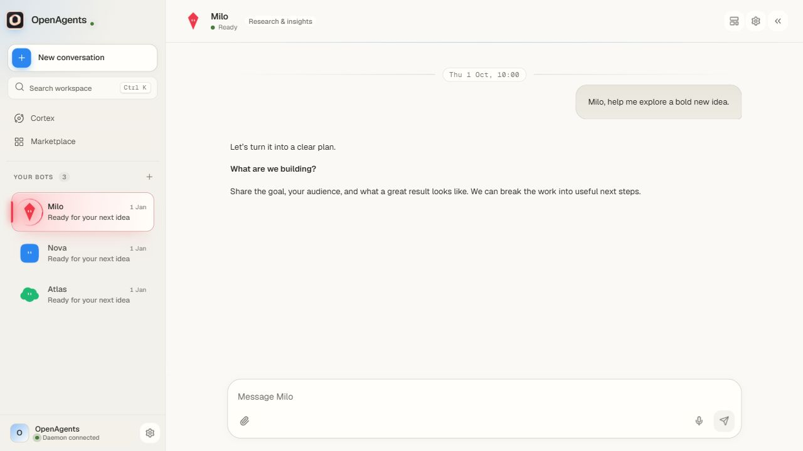

# OpenAgents

**Give your ideas a team. Desktop AI teammates you can inspect, customize, and build on.**

OpenAgents is shared with the community, free of charge. **This project is for you:** explore the code, give your bots a personality, improve the interface, add integrations, fix problems, and help make it better for everyone. Contributions from first-time contributors and experienced developers are welcome.

Special thanks to **[FreeLLMAPI](https://github.com/tashfeenahmed/freellmapi)** and its contributors for making free-tier model access easier to bring into one OpenAI-compatible gateway. OpenAgents can connect to a gateway you run and configure yourself. Thank you, too, to every developer whose libraries, tools, bug reports, and ideas make this project possible.

**Free software does not mean unlimited free inference.** OpenAgents does not charge an app subscription. Model providers, gateway services, Docker products, and hosting have their own terms, quotas, and possible costs. No API keys or funded accounts are included. The example configuration names a model that may be paid; select an eligible free model yourself if you want a free-provider setup.

> **License note:** OpenAgents-authored code is MIT licensed. The currently bundled Aora expression engine and emotion data have separate non-commercial community terms. The complete bundled application is therefore not an unrestricted MIT-only distribution. Read [licensing and credits](docs/licensing-and-credits.md) before commercial use or redistribution.



[App introduction](docs/media/OpenAgents-45s-No-Music.mp4) · [Get started](docs/getting-started.md) · [Contribute](CONTRIBUTING.md) · [Report a bug](https://github.com/Akak0o0y/OpenAgents/issues)

## What you can do

| Area | What is in the source |
| --- | --- |
| AI teammates | Named bots with roles, model selection, appearance controls, character settings, and chat history retained for up to 24 hours. |
| Direct work | Chat and bounded tasks, with activity, questions, approvals, results, and downloadable artifacts. |
| Repeat work | Scheduled routines, run history, attention states, and goal/result tracking. Routines need the runtime running. |
| Browser and computer work | Managed browser sessions and a Docker-backed bot desktop. External actions have additional scope and approval checks. |
| Coding | Repository snapshots, scoped guidance, controlled tool access, checked patches, and reviewable results. |
| Documents | Text and rich attachments, supported Office/PDF workflows, and English/Arabic OCR. |
| Model choice | Direct provider paths and configurable OpenAI-compatible connections, including FreeLLMAPI. Model capabilities and availability vary. |
| Visibility | Activity history, budget accounting, and Cortex views of runtime events. A successful tool response is not automatically proof of an external action. |

Chat messages and cached chat requests expire after 24 hours while the runtime is open, and overdue content is cleared when it starts. An in-progress chat finishes before its history is cleared. Task runs, routine results, artifacts, activity evidence, and budget records have separate retention; clearing chat does not erase them. Existing profile backups are separate recovery copies and are not rewritten.

This is an **early community source release, version 0.6.3**. Expect bugs and unfinished areas. Windows desktop has received the most development attention. Linux/macOS runtime work is supported in the code, but their packaged apps and protected credential storage are not at Windows parity. See [known limitations](docs/known-limitations.md) and [validation](docs/validation.md).

## Try the Windows app — no build required

**[Download the portable app](https://github.com/Akak0o0y/OpenAgents/releases/download/v0.6.3-preview.1/OpenAgents-0.6.3-portable.exe)** for a quick trial, or use the **[Windows installer](https://github.com/Akak0o0y/OpenAgents/releases/download/v0.6.3-preview.1/OpenAgents-0.6.3-setup.exe)**. Both are unsigned **Windows x64 preview builds** of 0.6.3 with known bugs; [release notes and checksums](https://github.com/Akak0o0y/OpenAgents/releases/tag/v0.6.3-preview.1) describe validation and limits.

The packaged app includes its runtime. Real AI work still needs your own model connection, and isolated desktop/coding work needs Docker Linux containers. Follow the **[Windows trial guide](docs/try-windows.md)** for first run, WSL, providers, and profile storage. Developers can also build from source below.

## Requirements at a glance

| Requirement | When you need it |
| --- | --- |
| Git and Node.js **22.13 or newer** | Building/running from source. Node 24 is the recommended development baseline. |
| npm | Install the root, web, and optional desktop dependency sets from the committed lockfiles. |
| Docker with **Linux containers** | Isolated coding checks and the bot desktop. Basic UI development does not require a running Docker engine. |
| Windows virtualization and WSL 2 | For the Docker Desktop WSL backend. A separate Linux computer is **not** required. A user-managed Ubuntu distro is optional. |
| Chromium | Managed-browser work and browser integration tests; install with `npm run browser:install`. |
| A configured model provider | Real AI responses. A provider's free tier is subject to that provider's limits. |
| Internet access | Dependency/browser/image downloads and remote models or web tasks. |

Plan for several GB of free disk space for dependencies, browsers, and Docker images. More RAM helps when running multiple bots; start with one concurrent task. These are practical planning notes, not measured hardware minimums. Follow the linked vendor requirements in the setup guide.

## Start from source

```bash
git clone https://github.com/Akak0o0y/OpenAgents.git
cd OpenAgents
npm ci
npm --prefix web ci
npm run build
npm run web:build
```

Create your local files (they are ignored by Git):

```powershell
# Windows PowerShell
Copy-Item .env.example .env
Copy-Item openhours.config.example.json openhours.config.json
```

```bash
# Linux / macOS
cp .env.example .env
cp openhours.config.example.json openhours.config.json
```

Read `.env.example` and configure your provider, or start the interface first and configure a supported provider connection in Settings. Then:

```bash
npm run daemon
```

Open **http://127.0.0.1:4001**. Browser access uses the local token generated beside the database in `data/openhours.db.auth.json`; enter it only into your local OpenAgents connection screen. Do not share or commit it. The desktop shell handles its own local connection.

For the Electron shell, install its separate dependencies and generate icons:

```bash
npm --prefix desktop ci
npm --prefix desktop run icon
npm run desktop
```

The shell manages a daemon/profile of its own. Stop the standalone daemon first if you want one runtime, and follow [development](docs/development.md) for hot reload and explicit profiles. No preconfigured personal profile, provider key, signed installer, or hosted service is shipped in this source repository.

## Documentation

| Guide | What it explains |
| --- | --- |
| [Getting started](docs/getting-started.md) | Windows/WSL, Linux/macOS, Docker, browser setup, first run, and updates. |
| [Providers and FreeLLMAPI](docs/providers.md) | Free-provider setup, gateway keys, model routing, quotas, and platform limits. |
| [Configuration](docs/configuration.md) | Bots, roles, budgets, routines, repositories, MCP, environment variables, and local files. |
| [Architecture](docs/architecture.md) | The desktop shell, React UI, daemon, scheduler, kernel, data, and execution boundaries. |
| [Development and testing](docs/development.md) | Commands, test families, builds, debugging, CI, and packaging. |
| [Customization](docs/customization.md) | Where to change visuals, bot behavior, providers, tools, and task contracts. |
| [Privacy and security](docs/privacy-and-security.md) | Local storage, network boundaries, credentials, source publication, and safe diagnostics. |
| [Troubleshooting](docs/troubleshooting.md) | Common startup, Docker, provider, browser, build, and profile problems. |
| [Known limitations](docs/known-limitations.md) | Work that still needs fixing and useful contribution areas. |
| [Licensing and credits](docs/licensing-and-credits.md) | MIT scope, third-party exceptions, and acknowledgements. |
| [Contributing](CONTRIBUTING.md) | Forks, branches, tests, issues, pull requests, and review expectations. |

## Make it yours

You do not need permission to propose a fix or fork the MIT portions. Start with a reproducible bug, a clearer document, an accessibility improvement, a provider compatibility test, or a platform fix. Keep third-party notices intact and follow the terms of any bundled component you reuse.

**Build something useful. Share what you learn. Help the next developer get further.**
