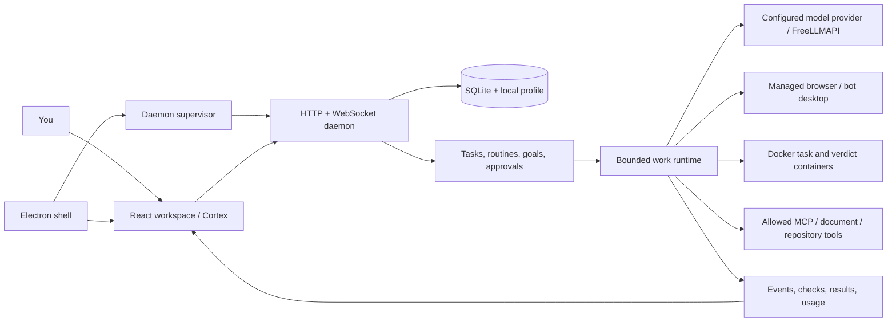

# Architecture and source map

OpenAgents is a local desktop application around a Node.js agent runtime. The browser UI, Electron shell, and daemon are separate pieces. It is not a multi-tenant hosted SaaS, and exposing its loopback API publicly is outside the supported deployment model.

## Packages

| Location | Responsibility |
| --- | --- |
| `package.json`, `src/` | TypeScript daemon, kernel, provider protocols, document tools, evaluation infrastructure. |
| `web/` | React/Vite UI: workspace, settings, characters, activity, and Cortex. Has its own lockfile. |
| `desktop/` | Electron process, lifecycle, startup/setup, windows, tray, downloads, and packaging. Has its own lockfile. |
| `docker/` | Bot-desktop image and OpenCode execution image definitions. |
| `tests/` | Backend contracts, fixtures, runtime integration, security boundaries, and provider behavior. |
| `desktop/tests/`, `web/src/**/*.test.*` | Shell tests and frontend component tests. |
| `scripts/` | Build/verification tools, synthetic UI previews, qualification and local delivery scripts. |
| `docs/` | Community guides, implementation notes, and synthetic product media. |

## A request through the system

The UI submits a request to the authenticated local API. The daemon loads bot configuration, checks available capabilities and permissions, and records work state. Scheduling, admission/budget checks, questions, and approvals can prevent or delay execution. The work runtime selects permitted actions; providers supply model output, while tools interact with repositories, browsers, files, or other explicitly configured systems.

Results and tool traces are persisted and streamed to the UI. A progress event means work is in progress, not that the requested external outcome exists. Publication-related code keeps intent, attempted action, receipt, and verified result distinct. Recovered or cancelled runs need honest terminal states; contributors should not replace a missing result with optimistic success copy.

## Main modules to read

| Files | Subject |
| --- | --- |
| `src/daemon/index.ts`, `ws-server.ts`, `local-auth.ts` | Startup, API wiring, transport, local authentication, profile lock. |
| `config-file.ts`, `config.ts`, `src/kernel/env-alias.ts` | Fleet schema, runtime bounds, settings compatibility. |
| `agent-store.ts`, `scheduler.ts`, `work-runtime.ts` | Persistent state, dispatch, bounded action execution. |
| `routine-*.ts`, `goal-results.ts`, `work-results.ts` | Recurring work, attention/history, completion/result tracking. |
| `provider-connections.ts`, `local-gateway.ts`, `secret-store.ts` | Model gateways, FreeLLMAPI supervision, protected credentials. |
| `src/evals/llm-client.ts`, `src/evals/llm/` | Model calls, provider translation, streaming and assembly. |
| `browser-*.ts`, `bot-desktop.ts`, `flow-*.ts` | Browser sessions, Docker desktop, recorded/compiled flows and publication checks. |
| `repository-*.ts`, `workspace-guidance.ts`, `work-contract.ts` | Source snapshots, scoped instructions, publication and verifiable work contracts. |
| `character-*.ts` | Identity, voice, recall, evidence/claims, proposals, review, retention and character growth. |
| `src/kernel/`, `src/cortex/` | Container/security/cost boundaries and runtime-to-visualization mapping. |
| `web/src/components/GrokWorkspace.tsx`, `GrokChat.tsx`, `GrokScreen.tsx` | Primary app workspace, conversation and screen surfaces. |
| `web/src/lib/transport.ts`, `web/src/store.ts` | Client API contracts and UI state. |
| `desktop/src/main.mjs`, `daemon.mjs`, `sandbox-setup.mjs` | Shell lifecycle, daemon supervision and prerequisite setup. |

Some component names retain earlier design terminology; they are implementation names, not a claim of affiliation with another product. Persistent identifiers remain stable through the OpenAgents rename so existing profiles can still be read.

## Boundaries that matter when contributing

SQLite is local state, not a public interchange bundle. Profile credentials protect the local HTTP/WebSocket API. Different container purposes have different privilege/network requirements. MCP runs as a host process and must not be treated as automatically sandboxed. A browser logged into an account can cause real effects, so account/origin/action grants and result verification matter separately from ordinary chat permission.

Character identity, generated interpretation, stored memory, verified public claims, and appearance are distinct. A fluent model statement is not evidence. Preserve the character Off/parity path and versioned schemas. See [customization](customization.md), [privacy/security](privacy-and-security.md), and the tests beside each subsystem.
